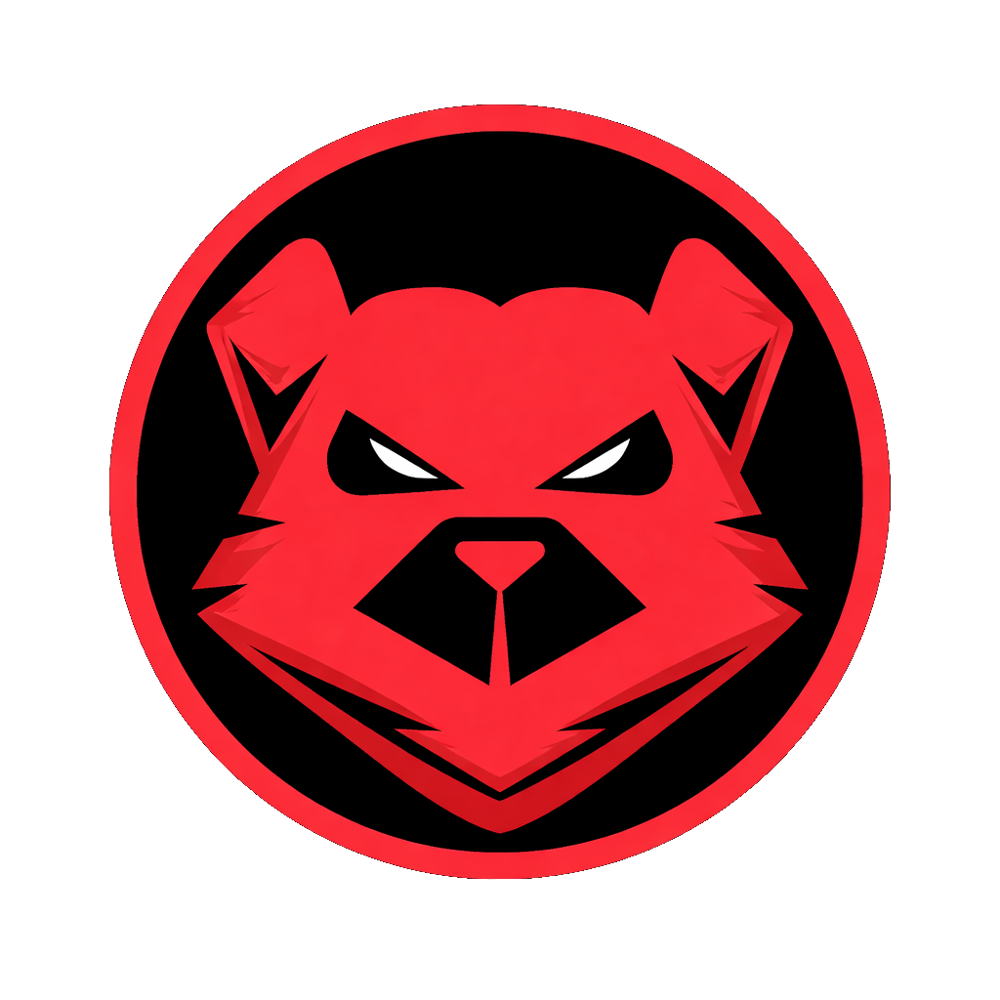

# Yuri Grom Guide Creation Protocol

This document outlines the required formatting and supported features for creating operational protocols (guides) for the Yuri Grom website.

---

## 1. Frontmatter (Metadata)

Every guide **must** start with a YAML frontmatter block. This metadata is parsed to generate the guide list and TOC.

```yaml
---
id: getting-started          # Optional: defaults to filename
title: "How to Pledge"        # Required: Display title
description: "Brief summary"  # Required: Shown in the list view
category: Basics              # Basics, Combat, Logistics, Strategy
diff: Beginner                # Beginner, Intermediate, Advanced
time: "~5 min"                # Estimated reading time
up: "3310.03.08"              # Update date (In-game format)
pinned: true                  # Optional: Pushes to top of list
icon: "🚀"                    # Optional: Emoji icon for the list
---
```

---

## 2. Table of Contents (TOC)

The TOC is automatically generated from all `##` (H2) headers in your Markdown.
*   **Recommendation:** Use `##` for main sections.
*   **Technical note:** The script assigns IDs like `sec-0`, `sec-1`, etc., to these headers for smooth scrolling.

---

## 3. Formatting Features

### Standard Markdown
All standard Markdown is supported (lists, bold, italics, links, code blocks).

### Tip Banners & Callouts
To add a highlighted tactical note or tip, use a `div` with the `callout` class:

```html
<div class="callout">
  <strong>TACTICAL ADVICE:</strong> 
  Always check the system state before committing to a reinforcement run.
</div>
```

### Images
Standard Markdown image syntax works. Images will automatically have a border and responsive width.

```markdown

```

#### Sizing & Alignment Helpers
To control size and text flow, wrap images in a `div` with these classes:
*   `img-small`: Max width 150px (best for icons/logos)
*   `img-medium`: Max width 400px
*   `img-center`: Centers the image on its own line
*   `img-left`: Floats image to the left (text wraps around right)
*   `img-right`: Floats image to the right (text wraps around left)

**Floating Example (Text wrap):**
```html
<div class="img-small img-left">



</div>

This text will now appear to the right of the logo and wrap underneath it once it passes the logo's height. Use the `img-left` or `img-right` classes to achieve this look.
```

**Centered Example:**
```html
<div class="img-small img-center">


</div>
```

> **Note:** Always leave a blank line before and after the `` inside the `div` to ensure Markdown parses correctly.

### Videos & Iframes
For YouTube videos or external dashboards, use a standard `<iframe>`. The site will automatically make it responsive (16:9).

```html
<iframe src="https://www.youtube.com/embed/VIDEO_ID" frameborder="0" allowfullscreen></iframe>
```

### Status Badges
You can use small inline spans for status or priority:

```html
<span class="badge badge-brand">High Priority</span>
<span class="badge badge-green">Secured</span>
<span class="badge badge-gold">Pinned</span>
```

---

## 4. Deployment

1.  Create your `.md` file in the `guides/` directory.
2.  Commit and push to GitHub.
3.  The **GitHub Action** will automatically run `generate_guides.py` to update `guides.json`.
4.  Your guide will appear on the site instantly.

---
// END PROTOCOL //
